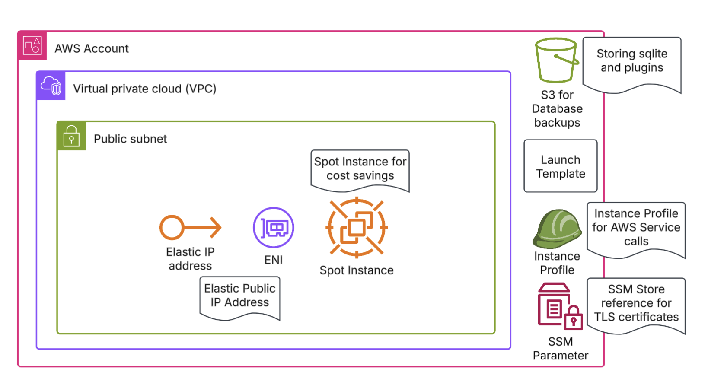

# terraform-aws-simple-grafana
A simple solution for self-hosting Grafana OSS on AWS. It is designed for __low cost__ and easy setup, the solution would rely on in-memory sqlite database by design and would utilize __spot__ instance (as it is hard coded into the module)

## Architecture Overview

### Details
1. The solution should be deployed to a public subnet where, public `Elastic IP Address` can be assigned to a network interface/EC2 instance
    1. The VPC and Subnet address should be provided as a `module` variable
1. The solution is utilizing `Spot Instance` type
    1. Instance type can be provided as a `module` variable
1. The solution is backing up the Grafana `sqlite` database and `plugins` to AWS S3
    1. S3 Bucket should be provided as a module variable

# Terraform Module Configuration
<!-- BEGIN_TF_DOCS -->
## Requirements

| Name | Version |
|------|---------|
|  [terraform](#requirement\_terraform) | >= 1.9.8 |
|  [aws](#requirement\_aws) | >= 5.97 |

## Providers

| Name | Version |
|------|---------|
|  [aws](#provider\_aws) | >= 5.97 |

## Modules

No modules.

## Resources

| Name | Type |
|------|------|
| [aws_eip.main](https://registry.terraform.io/providers/hashicorp/aws/latest/docs/resources/eip) | resource |
| [aws_eip_association.main](https://registry.terraform.io/providers/hashicorp/aws/latest/docs/resources/eip_association) | resource |
| [aws_iam_instance_profile.main](https://registry.terraform.io/providers/hashicorp/aws/latest/docs/resources/iam_instance_profile) | resource |
| [aws_iam_role.profile](https://registry.terraform.io/providers/hashicorp/aws/latest/docs/resources/iam_role) | resource |
| [aws_iam_role_policy.s3_permissions](https://registry.terraform.io/providers/hashicorp/aws/latest/docs/resources/iam_role_policy) | resource |
| [aws_iam_role_policy_attachment.profile_ssm](https://registry.terraform.io/providers/hashicorp/aws/latest/docs/resources/iam_role_policy_attachment) | resource |
| [aws_instance.main](https://registry.terraform.io/providers/hashicorp/aws/latest/docs/resources/instance) | resource |
| [aws_launch_template.main](https://registry.terraform.io/providers/hashicorp/aws/latest/docs/resources/launch_template) | resource |
| [aws_network_interface.main](https://registry.terraform.io/providers/hashicorp/aws/latest/docs/resources/network_interface) | resource |
| [aws_security_group.main](https://registry.terraform.io/providers/hashicorp/aws/latest/docs/resources/security_group) | resource |
| [aws_security_group_rule.main_egress_all](https://registry.terraform.io/providers/hashicorp/aws/latest/docs/resources/security_group_rule) | resource |
| [aws_security_group_rule.main_ingress_http](https://registry.terraform.io/providers/hashicorp/aws/latest/docs/resources/security_group_rule) | resource |
| [aws_security_group_rule.main_ingress_https](https://registry.terraform.io/providers/hashicorp/aws/latest/docs/resources/security_group_rule) | resource |
| [aws_iam_policy_document.assume_role](https://registry.terraform.io/providers/hashicorp/aws/latest/docs/data-sources/iam_policy_document) | data source |

## Inputs

| Name | Description | Type | Default | Required |
|------|-------------|------|---------|:--------:|
|  [backup\_bucket\_name](#input\_backup\_bucket\_name) | Name of the Backup Bucket | `string` | n/a | yes |
|  [block\_device\_mappings](#input\_block\_device\_mappings) | Attached EBS Root volume properties | <pre>object({     volume_type = string     volume_size = number     encrypted   = bool     iops        = number     throughput  = number   })</pre> | <pre>{   "encrypted": true,   "iops": 3000,   "throughput": 125,   "volume_size": 20,   "volume_type": "gp3" }</pre> | no |
|  [grafana\_config\_ini](#input\_grafana\_config\_ini) | n/a | <pre>object({     paths = object({       data               = optional(string, "/var/lib/grafana")       temp_data_lifetime = optional(string, "18h")       logs               = optional(string, "/var/lib/grafana/plugins")       plugins            = optional(string, "/var/log/grafana")     })   })</pre> | <pre>{   "paths": {     "data": "/var/lib/grafana",     "logs": "/var/lib/grafana/plugins",     "plugins": "/var/log/grafana",     "temp_data_lifetime": "18h"   } }</pre> | no |
|  [instance\_subnet\_id](#input\_instance\_subnet\_id) | The Subnet Id where the simple grafana stack will be launched | `string` | n/a | yes |
|  [instance\_type](#input\_instance\_type) | Instance Type of the Grafana Instance | `string` | `"t4g.small"` | no |
|  [nginx\_ssl\_cert\_key\_parameter\_name](#input\_nginx\_ssl\_cert\_key\_parameter\_name) | Name of the SSL parameter of TLS Certification Key for NGINX reverse proxy | `string` | n/a | yes |
|  [nginx\_ssl\_cert\_parameter\_name](#input\_nginx\_ssl\_cert\_parameter\_name) | Name of the SSL parameter of the TLS Certification for NGINX reverse proxy | `string` | n/a | yes |
|  [security\_group\_ids](#input\_security\_group\_ids) | Additional Security Group Ids attached to the Grafana Instance | `list(string)` | `[]` | no |
|  [vpc\_id](#input\_vpc\_id) | The VPC Id where the simple-grafana stack will be launched | `string` | n/a | yes |

## Outputs

| Name | Description |
|------|-------------|
|  [grafana\_instance\_public\_ip](#output\_grafana\_instance\_public\_ip) | Public IP Address of the Grafana Instance |
<!-- END_TF_DOCS -->
